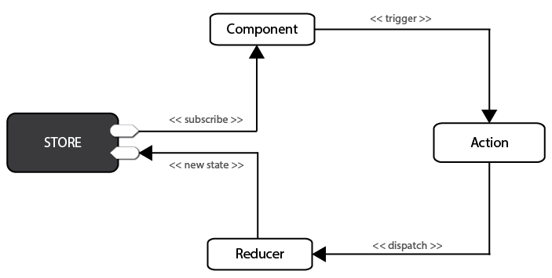

## flux

* 单向数据流，界面动作->dispatch action -> 改动store -> store state变化view

## redux
* redux添加了如下三条规则完善了flux思想，让程序更好维护
  * 唯一数据源：保证数据一致性，redux只允许一个store(可以通过combinereducer拆成module，vuex也是单一store自带module)
  * 保持state只读：不能变化state，必须dispatch action -> 新生成一份state -> state引起react view变化
  * reducer必须是纯函数(一份输入对应一份输出)：state在reducer处理，所以需要return一份新生成的state，state只有一层可以用`浅拷贝Object.assign`，多层要用`深拷贝`或者`逐层...扩展`或者`Immutability Helper的update方法`或者`Immutable.js`，
  * 这样数据流起点一致，终点一致，过程可预测，保证单向数据流
  * 流程如下：

  * 但是这样的话需要一个window.store全局对象，然后在每个组件写一次`store.getState(); store.dispatch({type: 'ADD_TODO'}); store.subscribe`，所以有了下面的`react-redux`

## react-redux
* `<Provider store={store}>` Provieder组件中通过`getChildContext`让子孙组件能通过`this.context.store`获取store
* connect源码
```
connect = (mapStateToProps, mapDispatchToProps)=>
...
this.context.store.subscribe(() => {
    this.setState(mapStateToProps(this.context.store.getState()))
})
...
mapDispatchToProps(this.context.store.dispatch)
```
* 在任意层次组件中都可用高阶组件connect
* mapStateToProps = (state) => {}，暴露state
* mapDispatchToProps = (dispatch) => {}，暴露dispatch

## immutable reselect
